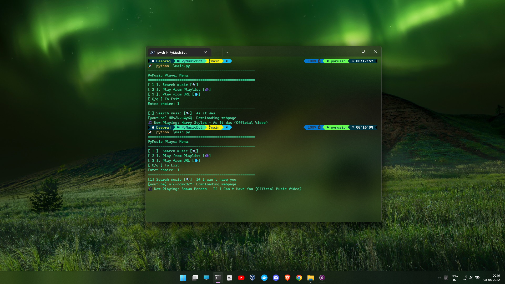

# PyMusic

A terminal music player that streams youtube songs.

## Installation
Clone the project locally:

    git clone ""

Navigate inside the PyMusic folder:

    cd path/to/PyMusic

Install using conda:

    conda create -n pymusic python=3.9

    conda activate pymusic

    pip install -r requirements.txt

## Run the player:
Run the player using python:

    python main.py

Run the player using `Batch script`:
    
    .\run.bat

Run the player using `Bash`:

    .\run.sh

## CLI Interface:
The CLI interface consists of:
- `Search Songs`
- `Play from Playlist`
- `Play from URL`
    
